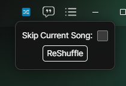

# ReShuffle

A [Cider](https://cider.sh) plugin to reshuffle the current queue.

The Plugin can be accessed by the 🔀 button added to the top right of
the Cider client.

If the `Skip Current Song` is disabled the queue will be reshuffled and the song will pause briefly and then resume at the same time mark.

If it's disabled it will reshuffle the queue and play a new song.

